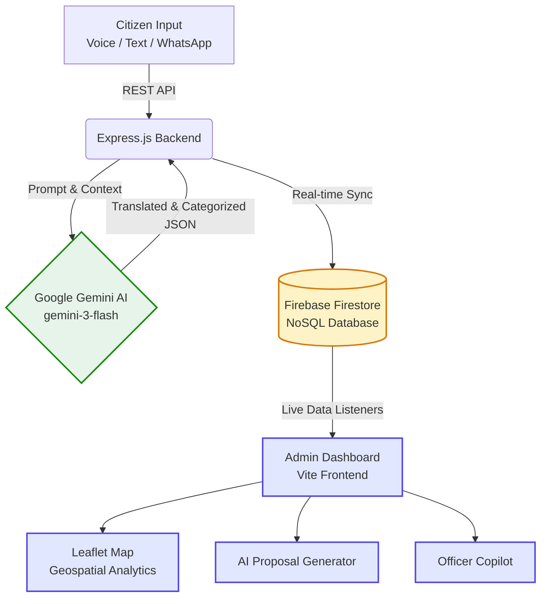

<div align="center">


# 🏛️ RMC Seva (MP Pulse Platform)
**Next-Generation AI-Powered Civic Grievance & Urban Prioritization Dashboard**

An enterprise-grade, omnichannel governance platform custom-built for the **Rajkot Municipal Corporation (RMC)** and Member of Parliament (MP) teams to seamlessly connect citizens with municipal infrastructure management.

[](https://choosealicense.com/licenses/mit/)
[](https://ai.google.dev/)
[](https://firebase.google.com/)
[](https://vitejs.dev/)

[View Live Demo](#) • [Report Bug](#) • [Request Feature](#)

</div>

---

## 📖 The Vision

In rapidly growing smart cities like Rajkot, municipal corporations receive thousands of infrastructure complaints daily across dozens of channels. 

**RMC Seva** solves the critical bottleneck of civic administration by leveraging **Generative AI** to instantly ingest, translate, classify, and geographically plot citizen grievances. By converting chaotic, multilingual citizen feedback into structured, actionable intelligence, MPs and municipal commissioners can make data-driven decisions on infrastructure funding and development in real-time.

---

## 🌟 Transformative Features

### 🧑‍🤝‍🧑 For Citizens: Frictionless Reporting
We believe government tech should adapt to the citizen, not the other way around.
- 📱 **Omnichannel Submissions:** Submit issues seamlessly via **Text, Voice, Photo Uploads, or a WhatsApp-style UI**.
- 🗣️ **Multilingual NLP:** Citizens can speak or type in their native **Gujarati or Hindi**. Our AI instantly translates and normalizes the input to formal English for official processing.
- ⚡ **Zero-Friction UI:** Designed following the highly accessible **Digital India / USWDS** aesthetic principles for maximum usability.

### 💼 For MPs & Officials: Data-Driven Governance
- 🗺️ **Live Spatial Analytics:** View Rajkot's 18 wards on a dynamic Leaflet map, automatically visualizing infrastructure problem hotspots (e.g., Water, Roads, Sanitation).
- 📈 **Dynamic Priority Matrix:** Automatically calculates algorithmic development priorities by combining **live feedback density** with **baseline infrastructure deficits** (BPL data, Water Quality Index).
- 📜 **1-Click Proposal Generator:** The AI automatically drafts formal, NIC-compliant Government Sanction Proposals and Budget Requests based on clustered citizen complaints.
- 🤖 **AI Executive Copilot:** A conversational assistant for administrators to query live civic data (e.g., *"Which wards need immediate water infrastructure funding?"*).
- 🛡️ **Ultimate Fallback Resiliency:** Engineered with a fail-safe architecture that intercepts third-party AI server outages and injects mock data to ensure **100% platform uptime** during critical presentations and field usage.

---

## 🧠 System Architecture

The platform operates on a decoupled architecture, ensuring massive scalability and real-time synchronization.



---

## 💻 Tech Stack

### Frontend Application
- **Framework:** Vanilla JS (ES6+) bundled with **Vite** for lightning-fast HMR.
- **Styling:** Custom CSS3 utilizing CSS variables, Flexbox/Grid, and responsive glassmorphism.
- **Mapping:** **Leaflet.js** combined with **Turf.js** for rendering custom digitized GeoJSON ward boundaries.
- **Hosting:** Firebase Hosting (Global Edge CDN).

### Backend API
- **Framework:** **Node.js** with **Express.js** for robust REST API orchestration.
- **AI Processing:** Google Generative AI SDK (`gemini-3-flash-preview` model) with smart fallback error handling.
- **Geocoding:** Google Maps API for precise area resolution.
- **Deployment:** Render PaaS.

### Database
- **Primary Datastore:** **Firebase Firestore** for real-time document syncing across municipal dashboard clients.

---

## 🚀 Installation & Setup

Want to deploy RMC Seva for your own municipality? Follow these steps:

### 1. Prerequisites
- [Node.js](https://nodejs.org/en/) (v18 or higher)
- A [Google AI Studio](https://aistudio.google.com/) API Key
- A [Firebase Project](https://console.firebase.google.com/)

### 2. Clone the Repository
```bash
git clone https://github.com/jd-thakrar/rajkot-civic-ai.git
cd rajkot-civic-ai
```

### 3. Install Dependencies
```bash
npm install
```

### 4. Configure Environment Variables
Create a `.env` file in the root directory and populate it with your credentials:
```env
# AI & Geolocation
GEMINI_API_KEY=your_google_ai_key
GOOGLE_MAPS_API_KEY=your_gmaps_key

# Frontend Firebase Configuration
VITE_FIREBASE_API_KEY=your_firebase_api_key
VITE_FIREBASE_AUTH_DOMAIN=your_project.firebaseapp.com
VITE_FIREBASE_PROJECT_ID=your_project_id
VITE_API_URL=http://localhost:3000

# Backend Firebase Admin Configuration
FIREBASE_PROJECT_ID=your_project_id
FIREBASE_SERVICE_ACCOUNT_JSON={"type":"service_account","project_id":"..."}
```

### 5. Launch the Platform
```bash
npm start
```
*This concurrently starts the Vite frontend at `http://localhost:5173` and the Express backend at `http://localhost:3000`.*

---

## 🛡️ License & Legal

This project is licensed under the **MIT License**. See the `LICENSE` file for details.
Designed exclusively for civic good and open governance.

---
<div align="center">
  <p><strong>RMC Seva</strong> • Empowering Citizens, Informing Leaders.</p>
</div>
