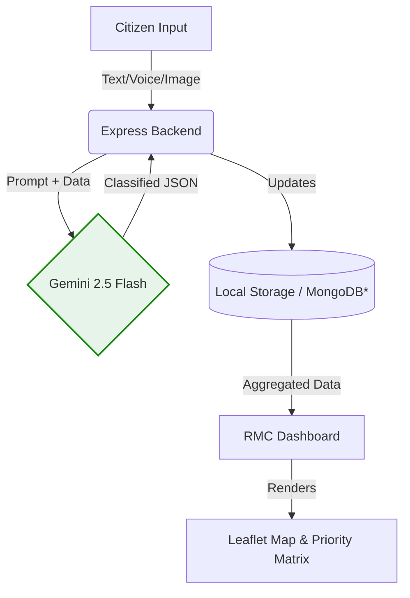

<div align="center">
  
  <br/>
  <h1>RMC-Pulse</h1>
  <p><strong>AI-Powered Civic Grievance & Prioritization Dashboard</strong></p>

  <p>
    <a href="#features">Features</a> •
    <a href="#architecture">Architecture</a> •
    <a href="#installation">Installation</a> •
    <a href="#api-reference">API</a>
  </p>
</div>

<br/>

RMC-Pulse is an intelligent civic administration dashboard built for the Rajkot Municipal Corporation (RMC). It modernizes public grievance redressal by leveraging **Google Gemini 2.5 Flash** for automated triage, multilingual translation, and dynamic infrastructure prioritization.

Designed with a clean, NIC (National Informatics Centre) compliant aesthetic, it provides both a citizen-facing portal and a powerful analytical backend for municipal officers.

## ✨ Features

- **🤖 Automated AI Triage:** Instantly classifies complaints (Water, Roads, Waste), extracts location data, and assigns urgency levels using Gemini.
- **🌍 Multilingual NLP:** Citizens can submit voice or text complaints in Gujarati, Hindi, or English. The AI automatically translates and normalizes the data for officials.
- **🗺️ Spatial Analytics:** Real-time Leaflet maps utilizing custom digitized GeoJSON boundaries for Rajkot's 18 wards to visualize problem hotspots.
- **📊 Dynamic Prioritization Matrix:** An algorithm that calculates ward-level development priorities by combining live feedback density with existing infrastructure deficits (Census/RMC data).
- **💬 Officer AI Copilot:** A conversational interface for administrators to query civic data ("Which wards need immediate water infrastructure funding?").

## 🏗️ Architecture


*\* Currently uses in-memory JSON for hackathon prototyping, architected for MongoDB migration.*

## 🚀 Quick Start

### Prerequisites
- Node.js (v18+)
- Google Gemini API Key

### Installation

1. **Clone the repo**
   ```bash
   git clone https://github.com/YOUR_USERNAME/rmc-pulse.git
   cd rmc-pulse
   ```

2. **Install dependencies**
   ```bash
   npm install
   ```

3. **Set up environment variables**
   Create a `.env` file in the root:
   ```env
   GEMINI_API_KEY=your_gemini_api_key_here
   ```

4. **Run the development server**
   ```bash
   npm start
   ```
   The application will be available at `http://localhost:3000`.

## 🌐 Deployment

This application requires a Node.js runtime environment.

- **Railway / Render:** Connect your GitHub repository, set the build command to `npm install`, the start command to `node server.js`, and add the `GEMINI_API_KEY` to the environment variables.
- **VPS (Ubuntu/Debian):** Use PM2 for process management: `pm2 start server.js --name rmc-pulse`.

## 📂 Project Structure

```text
.
├── server.js                 # Express server & Gemini API orchestration
├── app.js                    # Client-side logic, Map initialization, API calls
├── index.html                # Main UI layout (NIC Government aesthetic)
├── style.css                 # Responsive styling & CSS variables
├── mockData.js               # Rajkot ward demographics and baseline infra data
├── wardBoundaries.geojson    # Hand-digitized polygons for RMC Wards 1-18
├── suggestions.json          # Local database (auto-generated)
└── .env                      # Secrets (Not tracked in git)
```

## 🛣️ Roadmap

- [ ] **MERN Migration:** Replace `suggestions.json` with MongoDB Atlas for persistent storage.
- [ ] **Frontend Refactor:** Migrate Vanilla JS components to React/Vite.
- [ ] **Authentication:** Add JWT-based login for municipal officers.
- [ ] **Dashboard Analytics:** Integrate Chart.js for historical trend analysis.

## 📄 License

Distributed under the MIT License. See `LICENSE` for more information.
