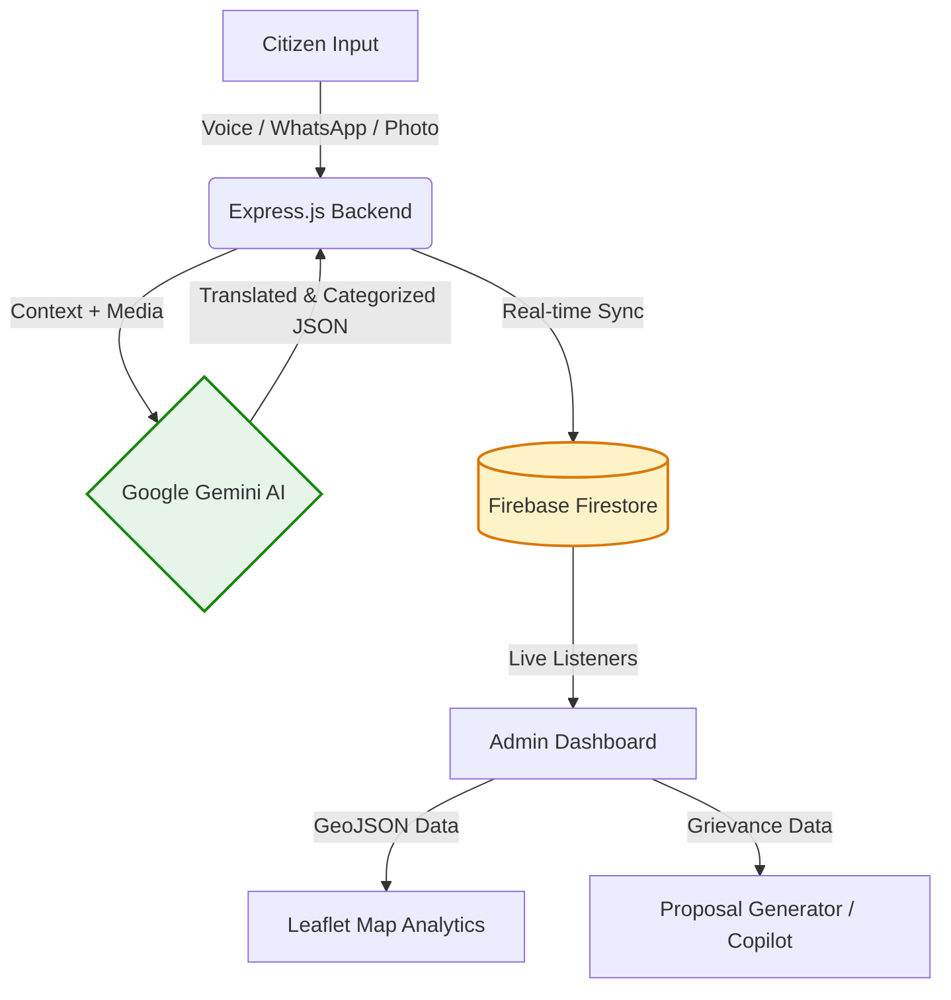

<div align="center">
  
  <br/>
  <h1>RMC Seva (MP Pulse Platform)</h1>
  <p><strong>Next-Generation AI-Powered Civic Grievance & Urban Prioritization Dashboard</strong></p>

  <p>
    <a href="#overview">Overview</a> •
    <a href="#key-features">Features</a> •
    <a href="#architecture">Architecture</a> •
    <a href="#tech-stack">Tech Stack</a> •
    <a href="#quick-start">Quick Start</a>
  </p>

  <p>
    
    
    
    
  </p>
</div>

<br/>

## 🏛️ Overview

**RMC Seva** is an intelligent, scalable civic administration platform custom-built for the Rajkot Municipal Corporation (RMC) and Member of Parliament (MP) teams. It modernizes urban governance by seamlessly connecting citizens with government officials through an AI-driven, multi-channel grievance redressal system.

By leveraging **Google Gemini AI**, the platform instantly translates citizen feedback from regional languages (Gujarati, Hindi) to English, auto-categorizes complaints, and prioritizes urban infrastructure needs. This empowers government teams to make data-driven financial and infrastructural decisions instantly.

---

## ✨ Key Features

### 👨‍👩‍👧‍👦 For Citizens (Seamless Reporting)
- **Omnichannel Input:** Citizens can submit issues via **Text, Voice, Photo, or a WhatsApp-style chat interface**.
- **Multilingual NLP:** Speak or type in native **Gujarati or Hindi**; the AI automatically translates and normalizes the data for officials.
- **Smart Auto-Categorization:** AI instantly detects the ward, extracts the precise locality, identifies the department (Water, Roads, Waste), and assesses urgency.

### 🏛️ For Officials & MPs (Data-Driven Governance)
- **Dynamic Prioritization Matrix:** An algorithm calculates ward-level development priorities by combining live citizen feedback density with existing infrastructure deficits (BPL data, Water Quality Index).
- **Formal Proposal Generator:** Automatically drafts official Government Sanction Proposals (in formal NIC-compliant English) based on clustered citizen complaints and estimated budgets.
- **AI Officer Copilot:** A conversational assistant for administrators to query live civic data (e.g., *"Which wards need immediate water infrastructure funding?"*).
- **Spatial Analytics:** Real-time map rendering of Rajkot's 18 wards to visualize problem hotspots and allocate resources effectively.
- **Ultimate Fallback Mode:** Engineered with a highly resilient architecture that intercepts AI server outages (503s/429s) and injects mock data to ensure 100% demo uptime.

---

## 🏗️ Architecture



---

## 🛠️ Tech Stack

- **Frontend:** HTML5, CSS3 (USWDS/Digital India Theme), Vanilla JS (ES6+), Vite, Leaflet.js
- **Backend:** Node.js, Express.js, REST APIs
- **Database:** Firebase Firestore (NoSQL, Real-time)
- **AI & Integrations:** Google Generative AI (`gemini-3-flash-preview`), Web Speech API, Google Maps Geocoding
- **Deployment:** Firebase Hosting (Frontend), Render PaaS (Backend)

---

## 🚀 Quick Start

### Prerequisites
- Node.js (v18+)
- Google Gemini API Key
- Firebase Service Account & Project Configuration

### Local Installation

1. **Clone the repository**
   ```bash
   git clone https://github.com/jd-thakrar/rajkot-civic-ai.git
   cd rajkot-civic-ai
   ```

2. **Install dependencies**
   ```bash
   npm install
   ```

3. **Configure Environment Variables**
   Create a `.env` file in the root directory:
   ```env
   # API Keys
   GEMINI_API_KEY=your_google_ai_key
   GOOGLE_MAPS_API_KEY=your_gmaps_key

   # Firebase Client Config (For Vite)
   VITE_FIREBASE_API_KEY=...
   VITE_FIREBASE_AUTH_DOMAIN=...
   VITE_FIREBASE_PROJECT_ID=...
   VITE_API_URL=http://localhost:3000

   # Firebase Admin Config (For Node)
   FIREBASE_PROJECT_ID=...
   FIREBASE_SERVICE_ACCOUNT_JSON={"type":"service_account", ...}
   ```

4. **Start the Platform**
   ```bash
   # Starts both Vite (Frontend) and Express (Backend) concurrently
   npm start
   ```
   - Frontend: `http://localhost:5173`
   - Backend API: `http://localhost:3000`

---

## 🌐 Deployment

The platform is designed for a decoupled deployment architecture:

1. **Frontend (Firebase Hosting)**
   ```bash
   npm run build
   firebase deploy --only hosting
   ```

2. **Backend (Render / Railway / VPS)**
   - Connect the repository to your PaaS of choice.
   - Set Build Command: `npm install`
   - Set Start Command: `npm run server`
   - Ensure all `.env` secrets are added to the platform's environment settings.

---

## 📂 Project Structure

```text
.
├── src/
│   ├── client/           # Frontend assets & scripts
│   └── server/           # Express backend
│       ├── config/       # Environment & Firebase init
│       ├── routes/       # API endpoints (analyze, copilot, wards)
│       └── services/     # Gemini integration, Geocoding, Firestore repos
├── dist/                 # Production build output
├── *.html                # Entry pages (index, citizen, dashboard, login)
├── *.css                 # Styling (Digital India Theme)
└── package.json          # Dependencies & scripts
```

---

<div align="center">
  <p>Built with ❤️ for the citizens of Rajkot.</p>
</div>
